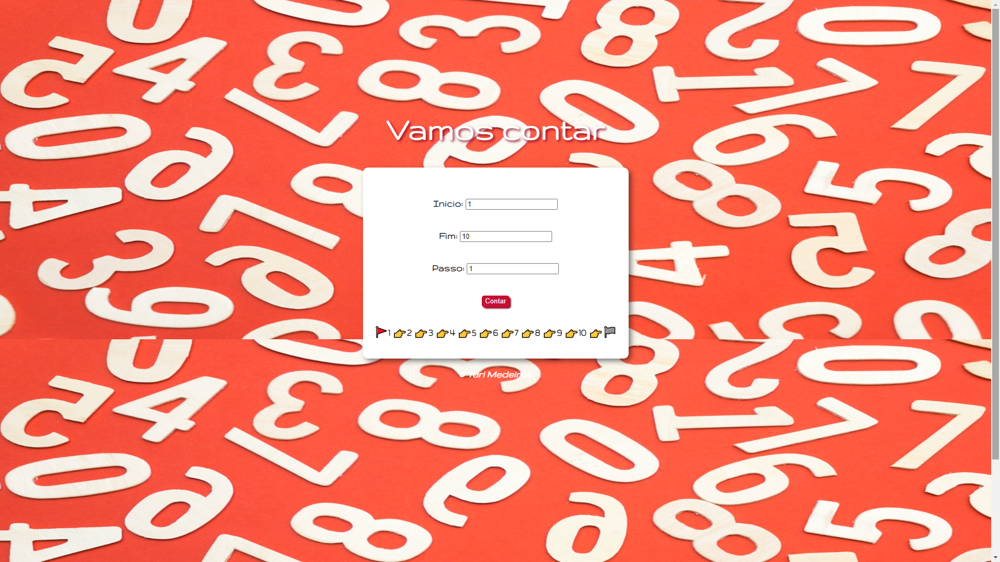
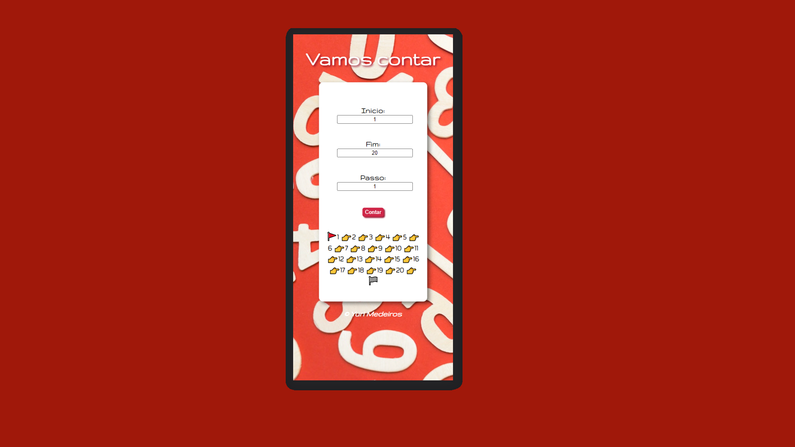

# Counter

### About Counter / Sobre o Counter

The accountant project was developed to assist in teaching children. Its main objective is to create a sequence of numbers, so that a instructor can use them as a visual resource for children to become familiar with the numbers and their respective sequences. The instructor can count a reverse function of the numbers, just inverting the ending and starting number, and also making the step negative.
 
 
O projeto contador, foi desenvolvido para auxiliar no ensino de crianças. Seu principal objetivo é criar uma sequencia de números, afim de que um instrutor possa utilizá-los como recurso visual para crianças se familiarizarem com os números e suas respectivas sequências. O instrutor pode contar uma função reversa dos números, apenas invertendo o número final e inicial, e também tornando o passo negativo.

 
 

> Counter Interface running in a Large Screen/ Interface do Counter(Contador) funcionando em uma tela de alta escala.

> Counter Interface running in a Mobile Screen/ Interface do Counter(Contador) funcionando em um dispositivo móvel.

### Click at link below to see it working! / Clique no link abaixo para vê-lo funcionando!
<a href="https://yurimayk.github.io/Counter/">Clique aqui!</a>

### Project steps/Etapas do Projeto

The project is not under development. Below are the definitions of performed tasks to finish it:
 
O projeto não está em desenvolvimento. Abaixo estão as definições de tarefas executadas para finalizá-lo:

- [x] Create HTML/Criar estrutura HTML;
- [x] Create CSS/Estilização com CSS;
- [x] Improve responsiveness/Aprimorar responsividade;
- [x] Add JavaScript/Adicionar JavaScript;
- [x] Make the project available online/Disponibilizar o projeto, online;

## 🤝 Contributor/Colaborador

The creator, and developer, of this project:
 
O criador e desenvolvedor deste projeto:

<table>
  <tr>
    <td align="center">
      <a href="#">
         
        
          <a href="https://www.linkedin.com/in/yurimayk/" target="_blank"><b>Yuri Medeiros</b></a>
        
      </a>
    </td>
</table>

[⬆ Voltar ao topo](#nome-do-projeto) 
